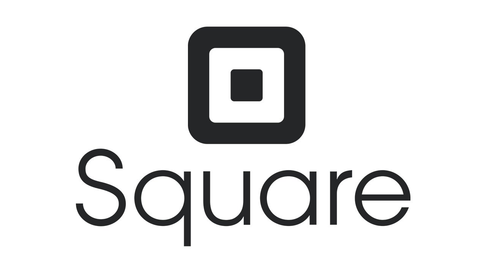

# Case Study of Square

# Square

## Table of Contents
[Overview and Origin](#overview-and-origin)

[Business Activities](#business-activities)

[Landscape](#landscape)

[Results](#results)

[Recommendations](#recommendations)

[References](#references)

## Overview and Origin

Square was founded in 2009 by Twiter co-founder Jack Dorsey and Jim McKelvey [[1]](https://www.investopedia.com/articles/tech/021017/square.asp). According to a 2010 article by Fast Company, the origins of Square came from James McKelvey's crafting business [[2]](https://www.fastcompany.com/1643271/square-brings-credit-card-swiping-mobile-masses-starting-today). He would frequently have people who would love to buy a piece of work; however, because he was not able to accept cards as payment, his customers would not be able to make payment and the sale would be lost. When this was shared with his friend Jack Dorsey, the two of them set about to create a solution that would make card acceptance easy for small businesses like that of McKelvey.

From there, the business grew through eight rounds of funding, raising $590.5M [[3]](https://angel.co/company/square/funding). Square then went on to IPO in November of 2015. Since then, especially with the developements of the global pandemic, Square's market cap is sitting above $64B. Along with this growth, Square's portfolio of products and services for its merchant acquiring and payment terminals grown to include e-commerce, marketing, business analytics, and payroll tools -- this part of their business is categorized as their "Seller Ecosystem" segment in their financial filings [[4]](https://squareup.com/us/en). Not only that, it has also expanded into the consumer market with its Cash App, allowing for P2P payments, direct deposits, and investing [[5]](https://cash.app). For the purposes of this case study, I will be focusing on the core value proposition that launched Square into the spotlight -- the Seller Ecosystem, most prominently, its merchant acquiring and payment terminals business.

## Business Activities

At its outset, the primarily objective was simple -- how could small to medium-sized business accept payment cards without the often expensive and complex processes of engaging with various payment terminals providers, payment processors, and merchant acquirers. Thus, Square's initial goal was to fill in this gap by simplifying the process and make transparent the costs and fees of card acceptance.

The company's target customer are business owners of small to medium-sized businesses who wanted to accept payment cards. As of 2018, the US Small Business Administration (SBA) Office of Advocacy estimates thtat there are about 30.2M small business in the United States, making up a whopping 99.9% of all United States businesses [[6]](https://www.sba.gov/sites/default/files/advocacy/2018-Small-Business-Profiles-US.pdf). We must take into account that the SBA has varying classifications of small businesses, depending on the indsutry -- ranging from 250 to 1500 employees or $750,000 to $38.5M in revenue [[7]](https://www.fundera.com/blog/sba-definition-of-small-business), so this count may include businesses that are larger than what the everday person may think of when it comes to a "small business." Even with that in mind, the sheer fact that small businesses makes up 99.9% of all United States businesses presents itself a very enticing market.

At first, the value proposition of Square was fairly simple -- they were offering a cheap, hassle-free, and intuitive payment system to merchants. That alone set them apart from many of the players in the field at the time of their inception. Since then, they have expanded upon this by integrating analytics insights with their payment terminals, offering merchants statistics on their businesses that would have otherwise been time consuming to collect and calculate. Further, they have also expanded to use businesses' data in loan determinations and also payroll management, aiding in the people-management side of businesses as well. 

Compared to legacy merchant acquirers, the simplicity of adopting Square as well as the added benefits, Square becomes the ideal solution that fits most needs of small to medium-sized businesses.

Regarding the technology used by Square, it can be broken up into hardware and software components. For hardware, it is the actual payment terminals that merchants can use to accept payment cards or contactless payments. Square initially came out with a card reader that plugged into a smartphone's audio jack. Since then, it has expanded to provide more integrations with Android and iOS devices, such as turning iPads into more comprehensive point-of-sale systems, and even creating their own point-of-sale systems with all the bells and whistles of standard payment terminals. Square has also enhanced their card readers to be able to accept contactless payments like Apple Pay. All of their hardware today are compliant with Payment Card Industry Data Security Standards.

For its software use, Square leverages technologies in a number of ways. For one, it is using machine learning in its risk evaluation of giving loans to small businesses, greatly increasing the chance of small business receiving a loan, as opposed to the traditional lending eavenues [[8]](https://digital.hbs.edu/platform-rctom/submission/square-using-machine-learning-to-de-risk-small-business-lending/). Square also leverages cloud infrastructure to allow the processing of payments for merchants without the need for each merchant to own and maintain their own set of servers [[9]](https://squareup.com/us/en/townsquare/cloud-pos). They are likely also leveraging trends like big data and machine learning in their own determinations of market trends and evaluating the efficacy of their services and market penetration.

## Landscape

Because Square's seller ecosystem offerings are so diverse, it spans quite a few domains of the financial industry. For the purposes of this case study, we will be focusing primarily on the payment processing merchant acquiring aspect of Square's seller ecosystem business. 

At a high level, merchant acquiring is needed for merchants to process card payments. They act as the merchant's acquiring bank, holding funds from the customers' issuing banks until it is time to be remitted to the merchant. Legacy acquirers include companies like Bank of America Merchant Services, Fiserv (formerly First Data), and Chase Paymentech Solutions [[10]](https://www.capgemini.com/wp-content/uploads/2017/07/Challenges___Opportunities_for_Merchant_Acquirers.pdf). 

Over the last five to ten years, there have been more and more companies emerging to allow small businesses to accept payment cards from a variety of sources. From point-of-sale systems, services like Clover, PayPal Here, and Stripe provide payment terminals that run through various rails that enable merchants to accept cards without setting up with legacy acquirers. As e-commerce has rapidly expanded in prominence over the last few years, services provided by companies like Shopify and Strip allow merchants to expand card acceptance to the digital realm, providing sets of APIs for their websites. A major selling point of these services is that the companies offering the services typically handle all of the payment credentials, and thus, the merchants themselves do not need to worry as much about PCI DSS and other data security standards.

For Square, in the beginning, they were only competing against the legacy acquireres like BAMS, Fiserv, and Chase Paymentech, but as new players have innovated in this field, companies like Clover, PayPal, Stripe, and Shopify started jostling with Square for market share as well. To further complicate matters, Clover was acquired by Fiserv in 2012, and many payment terminal services also process payments through various acquirers.

## Results

Core metrics that companies in this domain use to measure success are payment volume or transaction volume processed through their systems. As different companies opt to report these in differing metrics, we will evaluate them based on the metrics they provide.

Up through 2020 Q1 of Square's fiscal year, they had been seeing continual growth in their gross payment volume (GPV), ranging from 14% to 25% YoY growth. However, in 2020 Q2, there was a decrease in 15% YoY due to the COVID-19 pandemic. One bright spot though, was that in 2020 Q2, Square saw over 50% YoY growth in online channels as more merchants enrolled in their services and more consumers shifted from in-person shopping to online shopping [[11]](https://s21.q4cdn.com/114365585/files/doc_financials/2020/Q2/2020-Q2-Shareholder-Letter-Square.pdf). In terms of volume, the 2020 Q2 volume processed was marked at $22.8B, down from $26.8B the year before.

Compared to legacy acquirers which process trillions of dollars of transactions a year -- Fiserv processes over $2.6T annually, Chase Paymentech processes over $1T annually [[12]](https://www.businessnewsdaily.com/8833-best-high-volume-credit-card-processor.html) [[13]](https://merchantservices.chase.com)-- Square's volume seems tiny, but it is important to note the rate at which it was growing year over year prior to the COVID-19 pandemic. 

More comparable is Shopify's gross merchandise volume, which roughly equates to the GPV reported by Square. In 2019, Shopify processed $61B in GMV, which was up 49% YoY from 2018. Averaged across the quarters, this comes out to a little over $15B, putting Square ahead by about $7B per quarter. However, just as Square's growth rate was notable when compared to legacy acquirers, Shopify is currently outpacing Square in growth and would be a notable competitor to monitor.

## Recommendations

## References

[1] https://www.investopedia.com/articles/tech/021017/square.asp

[2] https://www.fastcompany.com/1643271/square-brings-credit-card-swiping-mobile-masses-starting-today

[3] https://angel.co/company/square/funding

[4] https://squareup.com/us/en

[5] https://cash.app

[6] https://www.sba.gov/sites/default/files/advocacy/2018-Small-Business-Profiles-US.pdf

[7] https://www.fundera.com/blog/sba-definition-of-small-business

[8] https://digital.hbs.edu/platform-rctom/submission/square-using-machine-learning-to-de-risk-small-business-lending/

[9] https://squareup.com/us/en/townsquare/cloud-pos

[10] https://www.capgemini.com/wp-content/uploads/2017/07/Challenges___Opportunities_for_Merchant_Acquirers.pdf

[11] https://s21.q4cdn.com/114365585/files/doc_financials/2020/Q2/2020-Q2-Shareholder-Letter-Square.pdf

[12] https://www.businessnewsdaily.com/8833-best-high-volume-credit-card-processor.html

[13] https://merchantservices.chase.com