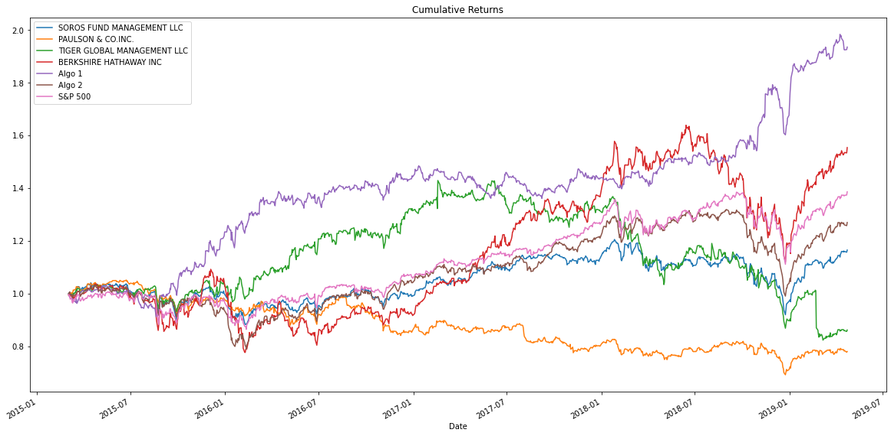
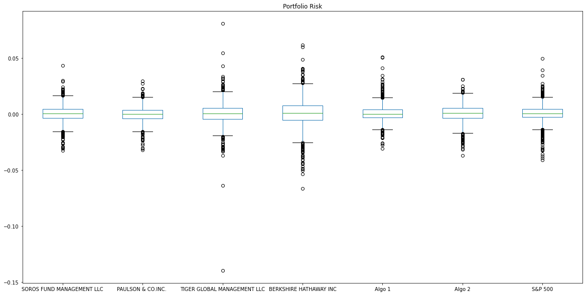
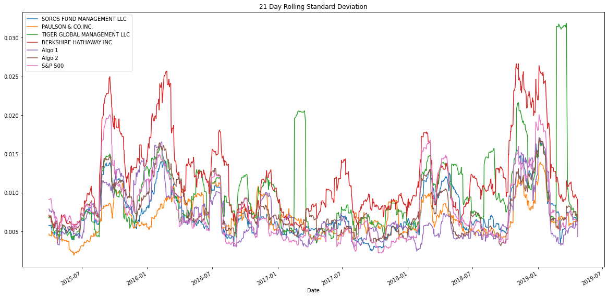
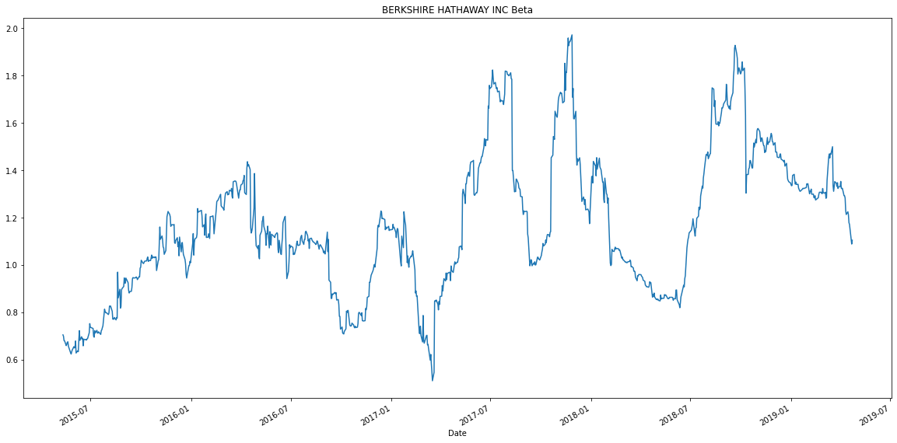
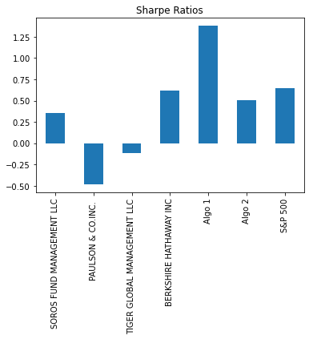
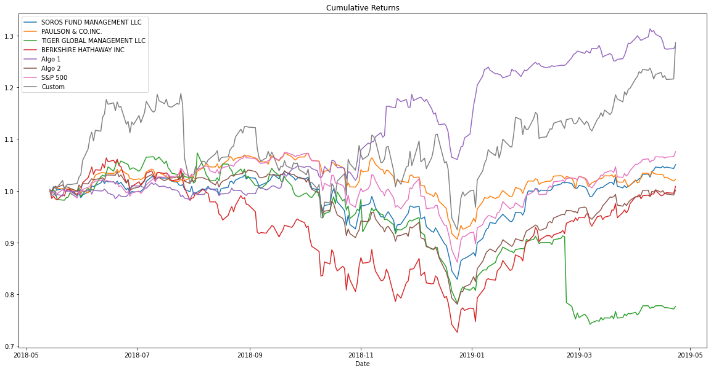

# Whale Portfolio Analysis
### By Albert Kong
---

# Whale Portfolios, Algorithms, and the Stock Market

## Returns

From the plot of the cumulative returns, it appears that there are only two portfolios that outperformed the S&P 500 -- Algo 1 and Berkshire Hathaway, Inc. Algo 1 far outperformed the other portfolios, and Berkshire Hathaway came out slightly ahead of the S&P 500. Though Algo 2 and Soros Fund Management did worse than the S&P 500, they still managed to turn a profit. Tiger Global Management LLC and Paulson & Co, Inc. performed the worst, with cumulative returns coming in lower than the initial investments.

## Risks

### Box and Whisker Plots

Moving onto the box plots, we are able to discern the spread of the returns for the various portfolios. We see that Tiger Global had the largest spread by far and that Paulson & Co, Inc was the smallest spread, followed closely by Algo 2. However, it is important to note that the Berkshire Hathaway's spread within one standard deviation of its mean was the largest (as shown by the largest "box"), indicating that their stocks overall likely had a larger spread -- compared to Tiger Global which had large spreads among the outliers, but tighter spread within one standard deviation of its mean.

### Standard Deviations

|Portfolio                  |Annualized Standard Deviation|
|---                        |-----|
|Soros Fund Management LLC  |0.125|
|Paulson & Co., Inc.        |0.111|
|Tiger Global Management LLC|0.173|
|Berkshire Hathaway, Inc.   |0.205|
|Algo 1                     |0.121|
|Algo 2                     |0.132|
|S&P 500                    |0.126|

When comparing standard deviations for each portfolio, we see that both Tiger Global and Berkshire Hathaway's portfolios come in as riskier than the S&P 500 -- this is likely due to the factors mentioned above -- a larger overall spread in Berkshire Hathaway's portfolio and high ranges between outliers for Tiger Global's portfolio.

### Rollings Standard Deviation

When displaying the 21 day rolling window, we see that , for the most part, the portfolios mimic the rise and fall of the S&P 500's standard deviation, though at times increasing in amplitude the shifts (in the case of Berkshire Hathaway). The only noteworthy portfolio is Tiger Global, which saw large jumps in standard deviation that are not correlated with periods of high volatility of the S&P 500.

### Correlation Table

|   |Soros Fund Management LLC|Paulson & Co., Inc.|Tiger Global Management LLC| Berkshire Hathaway, Inc.|Algo 1|Algo 2|S&P 500|
|---|---|---|---|---|---|---|---|---|
|**Soros Fund Management LLC**|1.000|0.699|0.561|0.754|0.321|0.827|0.838|
|**Paulson & Co., Inc.**|0.699|1.000|0.434|0.546|0.269|0.678|0.670|
|**Tiger Global Mangement LLC**|0.561|0.434|1.000|0.424|0.164|0.507|0.624|
|**Berkshire Hathaway, Inc.**|0.754|0.546|0.424|1.000|0.292|0.688|0.751|
|**Algo 1**|0.321|0.269|0.164|0.292|1.000|0.288|0.279|
|**Algo 2**|0.827|0.678|0.507|0.688|0.288|1.000|0.859|
|**S&P 500**|0.838|0.670|0.624|0.751|0.279|0.859|1.000|

From the correlation table, it seems that Algo 1 most closely mimics the movement of the S&P 500, followed closely by Soros Fund Management's portfolio. The remainder of the portfolios quickly drop off in correlation values.

### Selected Beta Comparison

From the beta value of Berkshire Hathaway's portfolio, it seems that it is not as sensitive to movements in the S&P 500. This is shown through the wide fluctuations of betas ranging from almost 2.0 to as low as roughly 0.5. This shows that depending on the time, Berkshire Hathaway's portfolio would sometimes be viewed as riskier or safer than the S&P 500's. As it is not consistently at or around 1, I would say that it would not be as sensitive to the movements of the S&P 500.

## Algorithmic Portfolio Performance

### Sharpe Ratios

|Portfolio                  |Annualized Sharpe Ratios|
|---                        |-----|
|Soros Fund Management LLC  | 0.356|
|Paulson & Co., Inc.        |-0.484|
|Tiger Global Management LLC|-0.121|
|Berkshire Hathaway, Inc.   | 0.622|
|Algo 1                     | 1.379|
|Algo 2                     | 0.501|
|S&P 500                    | 0.648|

On the basis of Sharpe Ratios, Algo 1 outperforms both the market and the portfolios of the whales by a substantial amount. Algo 2 though, is roughly in line with how Berkshire Hathaway and the S&P 500 performed, ranking slightly below the two. However, Algo 2 does outperform the other three whales.

---

# Custom Portfolio Comparison

I prepared a custom portfolio that consisted of Fiserv, Twitter, and PayPal stock.

## Returns

When comparing the cumulative returns against the rest of the portfolios, it fared consistently better than the portfolios of the whales as well as Algo 2. Toward the end of the period, it jumped up to nearly meet the returns of Algo 1.

## Risk

In