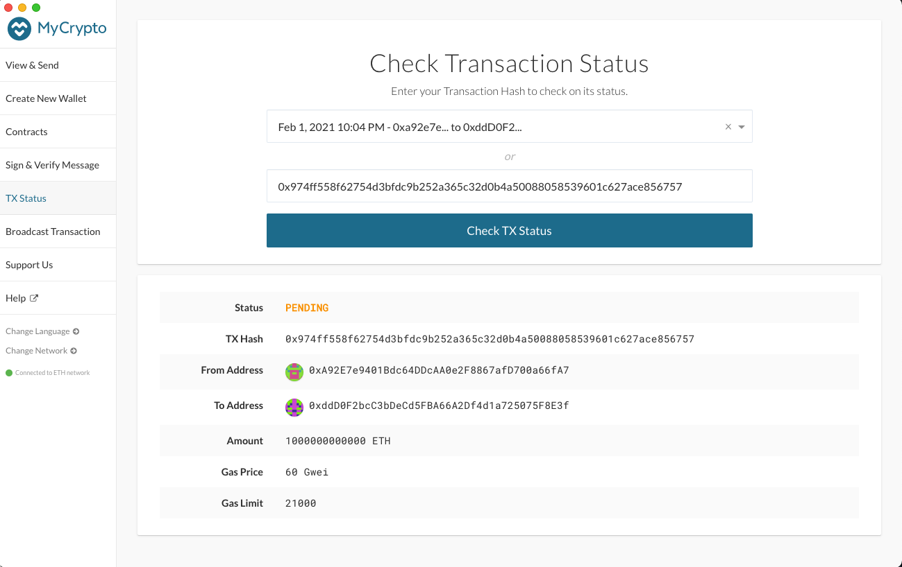

# ZBank Test Net

## Setting up the blockchain:

Included in this folder are the genesis configurations as well as the Keystore files of both nodes. To launch the chain, you would first need to run the following lines of code in separate terminals:

```
./geth --datadir node1 --unlock "0xA92E7e9401Bdc64DDcAA0e2F8867afD700a66fA7" --mine --rpc --allow-insecure-unlock

./geth --datadir node2 --unlock "0xddD0F2bcC3bDeCd5FBA66A2Df4d1a725075F8E3f" --mine --port 30304 --bootnodes "enode://SEALER_ONE_ENODE_ADDRESS@127.0.0.1:30303" --ipcdisable --allow-insecure-unlock
```

This will set-up the two nodes to get the chain running. The various geth flags that are used above have the following meanings:

| Flag                    | Description |
| ----------------------- | ----------- |
| --datadir               | indicates the data directory for the keystore file |
| --unlock                | indicates which accounts to unlock |
| --mine                  | enables mining |
| --rpc                   | enables the HTTP-RPC server |
| --port                  | indicates which port to use (necessary for running multiple nodes on one device) |
| --bootnodes             | indicates the enode URLs for P2P discovery bootstrap |
| --ipcdisable            | disables the IPC-RPC server |
| --allow-insecure-unlock | allows for insecure account unlocking |

## Setting up MyCrypto:

To connect MyCrypto to your network, you should:
1. Select "Change Network" on the sidebar. 
2. Select Add Custom Node
3. Enter the following:
    * Node Name: zbanknet
    * Network: Custom
    * Network Name: zbanknet
    * Currency: ETH
    * Chain ID: 2021
    * URL: http://127.0.0.1:8545/
4. Select Save & Use Custom Node

After setting up the network in MyCryptop, you are all set to send transactions by first accessing your wallet with a Keystore File (and the password 2021). After gaining access, you can then enter the address of the wallet you want to send to and enter the transaction amount.

The transaction confirmation will look like the following:


## Network Information:

### Network Name: zbanknet
Chain/Network ID: 2021

Blocktime: 15

### Node 1
Password: 2021

Public address of the key: 0xA92E7e9401Bdc64DDcAA0e2F8867afD700a66fA7

Path of the secret key file: node1/keystore/UTC--2021-02-02T02-43-32.747371000Z--a92e7e9401bdc64ddcaa0e2f8867afd700a66fa7

### Node 2
Password: 2021

Public address of the key: 0xddD0F2bcC3bDeCd5FBA66A2Df4d1a725075F8E3f

Path of the secret key file: node2/keystore/UTC--2021-02-02T02-43-54.451256000Z--ddd0f2bcc3bdecd5fba66a2df4d1a725075f8e3f

Test Transactions:

Transaction Hash: 0x974ff558f62754d3bfdc9b252a365c32d0b4a50088058539601c627ace856757

Transaction Hash: 0xf408c078d070ad3dd9f19f7dcce7d5edd16615238413177fadbbd9a6cfeb245a