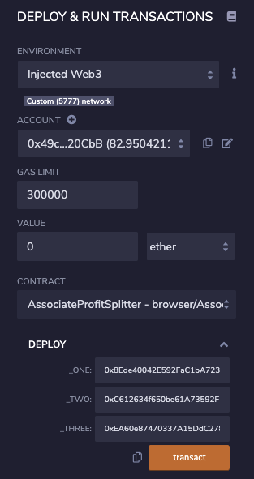
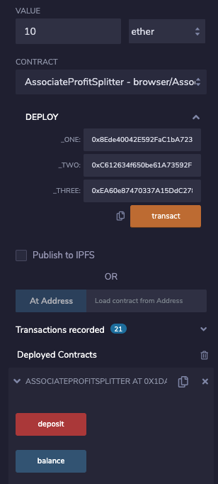
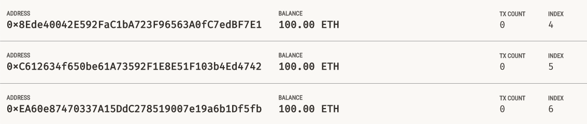
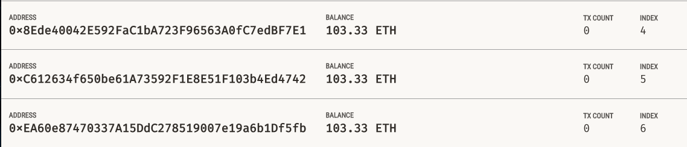
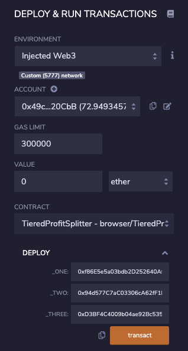
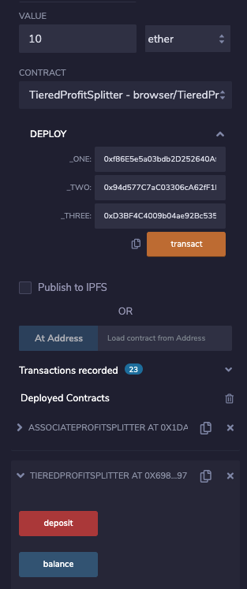
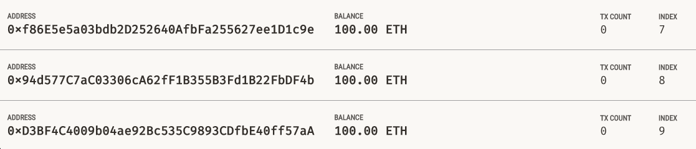
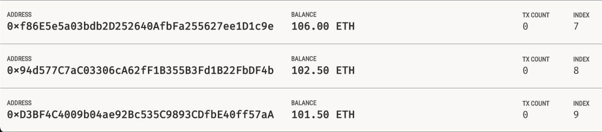

# Smart Contracts with Solidity

## Associate Profit Splitter

This contract accepts Ether into the contract and divides it evenly among the asscoiate level employees. Any remaining Ether is sent back to HR

Testnet Contract Address: 0x1DADcF6b6551e3897A794f4c1c580EC83B78a4aC

### Testing the Associate Profit Splitter
To deploy the contract, enter the three addresses of the employees and click transact.

To deposit into the employees' accounts, enter the amount of the deposit in the value box and click deposit.

These are the employees' accounts prior to the deposit:

These are the employees' accounts after the deposit:

## Tiered Profit Splitter

This contract distributes different percentages of incoming Ether to employees at different tiers. The CEO will receive 60% of the Ether, the CTO will receive 25%, and Bob will receive 15%. Any remaining Ether is sent to the CEO.

Testnet Contract Address: 0x6985Ef018A890Ea97a096c322A5DF87A0C997f28

### Testing the Tiered Profit Splitter
To deploy the contract, enter the addresses of the CEO, CTO, and Bob in the _ONE, _TWO, and _THREE fields, respectively, and click transact.

To deposit into the employees' accounts, enter the amount of the deposit in the value box and click deposit.

These are the employees' accounts prior to the deposit:

These are the employees' accounts after the deposit:

